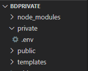
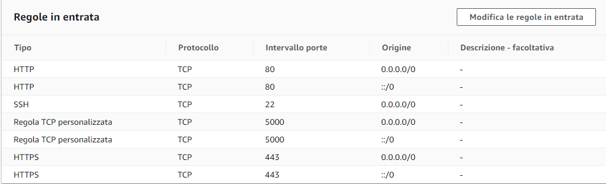
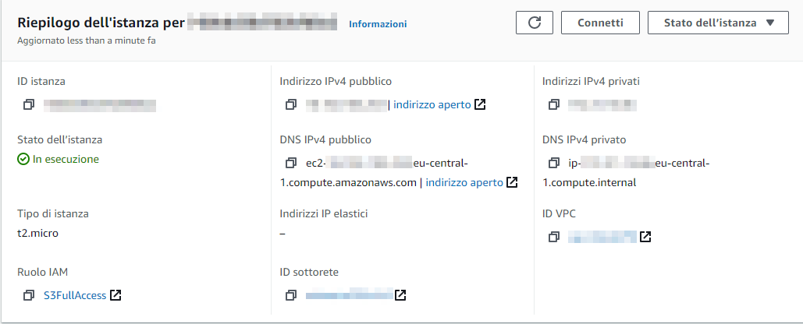

#  BassaDefinizione

> BassaDefinizione è un progetto creato per la candidatura a [Soluzioni Futura](https://github.com/soluzionifutura/sf-academy/blob/master/README.md). In particolare il percorso da me scelto è [Recensioni Film](https://github.com/soluzionifutura/sf-academy/blob/master/prove/recensioni-film.md) di difficoltà media e competenze richieste di web    development.


## Descrizione
 
Attraverso BassaDefinizione l'utente può:
  - Cercare un film
  - Votare da 1 a 10 un film
  - Registrarsi e loggarsi
  - Osservare la media voto degli utenti di uno specifico film
  - Visualizzare in ordine decrescente di valutazione i film votati
  - Cambiare tema da chiaro a scuro e viceversa

### API esterne
   
   Ogni informazione di qualsiasi film è ricavata da [OMDb API](http://www.omdbapi.com/), attraverso una richiesta GET nella quale va specificata una chiave identificativa
   
### Principali NPM packages utilizzati

 - [Express](https://www.npmjs.com/package/express)
 - [Hbs](https://www.npmjs.com/package/hbs)
 - [Dotenv](https://www.npmjs.com/package/dotenv)
 - [MySQL](https://www.npmjs.com/package/mysql)
 - [JWT](https://www.npmjs.com/package/jsonwebtoken)
 - [Bcrypt](https://www.npmjs.com/package/bcrypt)
 
### Database

 Diviso in due tabelle: 
 1. Informazioni di accesso criptate e ID di ciascuno utente
 2. Lista di film votati con relativo voto e ID dell'utente che lo ha votato
 
 Il Database è gestito con MYSQL collegato ad RDS
 
## Installazione


Aprire il terminale e clonare questa cartella

```bash
 $ git clone https://github.com/TheGodMorel/BassaDefinizione
```

In seguito installare i [packages NPM](https://www.npmjs.com/) 

```bash
 $ npm install
```

## Collegamento al database

Per permettere la creazione e il collegamento al database è necessario 

1. Creare un [account AWS](https://portal.aws.amazon.com/billing/signup#/start)
2. Creare un nuovo database utilizzando [Amazon RDS](https://eu-central-1.console.aws.amazon.com/rds/home)
3. Collegare il database RDS ad uno in locale 
   - Il nome deve essere il medesimo
   - Inserire l'endpoint del database RDS come Hostname del database locale
   - Lasciare come porta 3306
4. Nel database locale creare due tabelle chiamate <i>films</i> e <i>users</i>
   - Suddividere la prima in 3 colonne: <i>title</i> (string), <i>rating</i> (string) e <i>userID</i> (int)
   - Suddividere la seconda in 4 colonne: <i>id</i> (int auto_increment), <i>username</i> (string), <i>password</i> (string) e <i>mail</i> (string)
5. Ora che il database è pronto, si proceda a creare nella cartella clonata un'altra cartella chiamata <i>private</i> al cui interno andrà il file <i>.env</i>
<br>
6. In questo file inserire:
   - **OMDBKEY**: la chiave unica per accere all'OMDB API
   - **DB_HOST**: L'endpoint del database RDS
   - **DB_USER**: l'utente usato nel database
   - **DB_PASSWORD**: la password dell'utente
   - **DB_DATABASE**: il nome del database
   - **JWT_SECRETKEY**: chiave per cifrare un JWT
   - **JWT_EXPIRES_IN**: tempo di scadenza di un JWT
   - **COOKIE_EXPIRES_IN**: tempo di scadenza di un cookie (usato per salvare il jwt)
Per maggiori informazioni o in caso di difficoltà guardare [questo video](https://www.youtube.com/watch?v=Ng_zi11N4_c&t=1s)
   
   **Esempio** di file *.env*:
   ```javascript
      OMDBKEY = keyOmdbApi
      DB_HOST = nomedatabase.codice.eu-central-1.rds.amazonaws.com
      DB_USER = admin
      DB_PASSWORD = password
      DB_DATABASE = nomedatabase
      JWT_SECRETKEY = secretkey
      JWT_EXPIRES_IN = 90d
      COOKIE_EXPIRES_IN = 90
   ```

## Avvio in locale
Seguendo questi 2 semplici passaggi il sito sarà visibile solamente in locale all'IP 127.0.0.0
```bash
  $ cd BassaDefinizione
  $ node index.js
```

## Creazione di un'istanza Amazon EC2
 Affinchè possieda invece un indirizzo IP globale occorre: 
 1. Creare un'[istanza EC2](https://eu-central-1.console.aws.amazon.com/ec2)
    - Ruolo: S3FullAccess
    - Regole in entrata: 
    - Gruppo di Sicurezza per HTTP e SSH
    - Definire e scaricare una chiave SSH
2. Questa dovrà essere la configurazione finale dell'istanza: <br> 
3. Spostare il file contenente la chiave SSH all'interno della cartella *BassaDefinizione*  Nell'esempio il file è *bassadefinizione.pem*
## Collegamento ad Amazon EC2
1. Connettere la cartella all'istanza EC2 tramite [PuTTY](https://www.youtube.com/watch?v=bi7ow5NGC-U)
2. Eseguire questi comandi per inserire nell'istanza la cartella BassaDefinizione:
   ```bash
      $ ssh ec2-user@ip-0-0-0-0 -i bassadefinizione.pem
      $ sudo su
      $ cd 
      $ mkdir workspace
      $ cd workspace
      $ git clone https://github.com/TheGodMorel/BassaDefinizione
      $ cd BassaDefinizione
      $ node index.js
   ```
   **sostituire** 0-0-0-0 con l'indirizzo IPv4 pubblico dell'istanza
3. Ora il sito è visibile all'indirizzo IPv4 pubblico dell'istanza

## Futuri upgrade
  - [ ] Modificare la password
  - [ ] Accedere con più account contemporaneamente
  - [ ] Recensire un film
  - [ ] Visualizzare le recensioni degli altri utenti relative ad un film
  - [ ] Recuperare la password dimenticata
  
  

## Come contribuire al progetto
  Ogni nuova proposta è la benvenuta.
  Per farla bisogna seguire questi passaggi:
  1. [Forkare la repo](https://github.com/TheGodMorel/BassaDefinizione/fork)
  2. Creare un ramo secondario al master
  3. Commit dei cambiamenti
  4. Push del commit
  5. Creare una nuova Pull Request

## License
[MIT](https://choosealicense.com/licenses/mit/)
